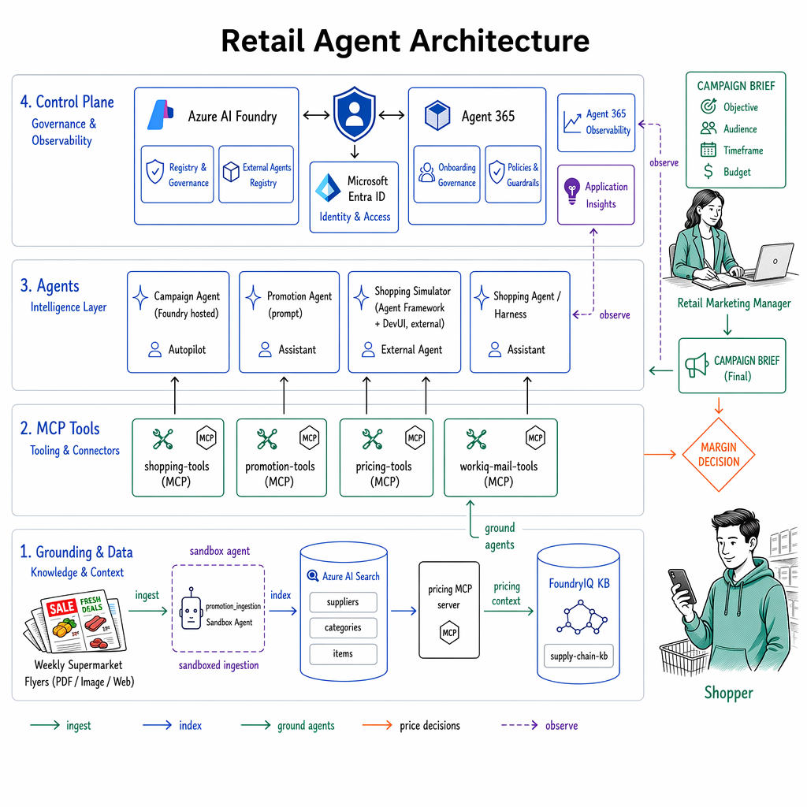
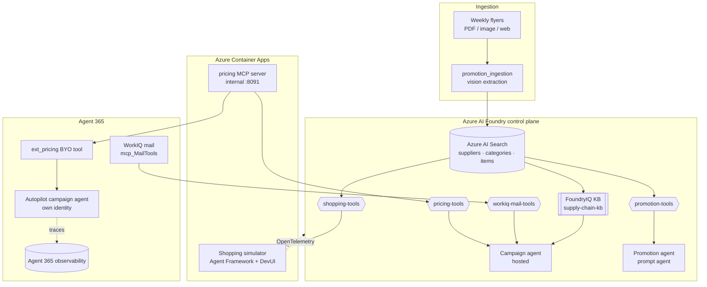

# agentic-supply-chain

An agentic scenario that solves **supplier optimization for retail shopping**. Weekly promotional flyers from multiple supermarkets are ingested and indexed, then agents and MCP-capable apps help users plan optimal shopping tours across stores.


## Narrative


This project shows the potential of running agents in **Azure AI Foundry** that
connect to enterprise assets and integrate with **Agent 365** agents and tools.
A retail supply-chain scenario ties it together: weekly promotional flyers from
many supermarkets are ingested, indexed and exposed as governed tools, then a
set of agents — some hosted inside Foundry, some running externally — reason over
that data for both shoppers and the retail marketing team.

The architecture has four layers: a **grounding/data layer** (Azure AI Search +
FoundryIQ knowledge base), a **tool layer** (MCP servers surfaced as Foundry
toolboxes), an **agent layer** (Foundry hosted agents, an Agent 365 onboarded
agent, and an external Agent Framework workflow), and a **control plane**
(Foundry + Agent 365 for identity, governance and observability).

### Grounding & Foundry data services

- **Azure AI Search** holds three indexes — `retail-suppliers`,
  `retail-categories`, `retail-items` — populated by the **promotion_ingestion**
  job, which runs vision-model extraction over flyer PDFs/images and normalises
  every offer into the shared `Supplier` / `Category` / `Item` model.
- **FoundryIQ knowledge base** (`supply-chain-kb`) aggregates those three indexes
  as knowledge sources (`retail-suppliers-ks`, `retail-categories-ks`,
  `retail-items-ks`) to enable **agentic retrieval** — multi-hop reasoning across
  suppliers, categories and items in a single query.
- The **Foundry project** is the hub: it serves chat/embedding models through its
  gateway via Entra ID (managed identity, no API keys), and hosts the agents,
  toolboxes and knowledge base.

### MCP servers and Foundry toolboxes

Tools are published once as **Foundry toolboxes** (an Entra-authenticated MCP
endpoint, `{project}/toolboxes/{name}/mcp?api-version=v1`) so they are discovered
and governed centrally rather than wired point-to-point:

- **`shopping-tools`** — wraps the three AI Search indexes as `supplier-search`,
  `category-search`, `item-search` (registered by
  `scripts/register_shopping_toolbox.py`). Consumed by the shopping simulator and
  shopping harness.
- **`promotion-tools`** — wraps the `retail-items` index as `promotion-search`
  (registered by `scripts/register_promotion_toolbox.py`). Consumed by the
  promotion agent.
- **`pricing-tools`** — wraps the **pricing MCP server**, exposing seven internal
  pricing tools (`list_categories`, `list_products`, `get_product_pricing`,
  `get_category_margin_forecast`, `get_volume_forecast`, `simulate_price_change`,
  `list_personas`). Consumed by the campaign agent.
- **`workiq-mail-tools`** — wraps the **Microsoft Agent 365 WorkIQ mail MCP
  server** (`mcp_MailTools`), exposing read/search/send M365 mail on behalf of
  the signed-in user (registered by `scripts/register_workiq_toolbox.py`).
  Consumed by the campaign agent to circulate finished campaign briefs.
- The **pricing MCP server** itself (`src/pricing_mcp_server`) runs as an
  *internal* Azure Container App on port `8091` serving streamable-HTTP MCP. It is
  registered **twice**: as the `pricing-tools` Foundry toolbox **and** as a BYO
  (`ext_pricing`) tool in **Agent 365**, so the same server is governable from
  both control planes.

### Agents and their relationships

- **Campaign agent** (`src/campaign_agent`) — a **Foundry hosted agent**
  (RESPONSES / A2A / INVOCATIONS) for the retail marketing team. It joins
  competitor promotions from AI Search (`retail-items`) with internal pricing
  from the `pricing-tools` toolbox to reason about **margin optimization per
  category and shopping persona**, and can circulate the finished campaign brief
  over M365 mail through the `workiq-mail-tools` (Agent 365 WorkIQ) toolbox.
- **Autopilot campaign agent** (`src/campaign_a365_agent`) — the same campaign
  capability **onboarded in Agent 365 with its own identity** (a Managed Agent
  Identity Blueprint), running as a Foundry hosted agent. It participates in
  Agent 365 agentic notifications and emits traces to **Agent 365 observability**
  using an exchanged agentic token.
- **Shopping simulator** (`src/shopping_simulations`) — a **Microsoft Agent
  Framework multi-agent workflow** (`selector → concurrent per-supplier bill
  slots → aggregator`) running **outside Foundry** in an Azure Container App and
  served on the Agent Framework **DevUI**. It grounds every step through the
  `shopping-tools` toolbox over MCP, and publishes **OpenTelemetry** to
  Application Insights so it can be registered as a Foundry **external agent** —
  surfacing its traces in the **Foundry control plane** (matched by
  `gen_ai.agent.id`).
- **Shopping agent / shopping harness** (`src/shopping_agent`,
  `src/shopping_harness`) — consumer-facing shopping assistants that reach retail
  data either through the `supply-chain-kb` knowledge base (agentic + semantic
  context providers) or through the `shopping-tools` toolbox.
- **Promotion agent** — a Foundry **prompt agent** exposed over RESPONSES / A2A /
  INVOCATIONS that surfaces promotion and pricing details via `promotion-tools`.

### How it all connects



---


## Components

| Component | Folder | Description |
|---|---|---|
| **shopping_chat** | `src/shopping_chat` | Containerized MCP app + interactive browser UI for product search, recommendations, and supplier inventory |
| **promotion_ingestion** | `src/promotion_ingestion` | Container job that downloads and indexes promotional flyers (PDF, images, websites) into Azure AI Search |
| **shopping_agent** | `src/shopping_agent` | Hosted agent with A2A-style HTTP API for shopping list optimization across current promotions |
| **shopping_simulations** | `src/shopping_simulations` | **Microsoft Agent Framework** multi-agent workflow (selector → concurrent per-supplier bill slots → aggregator) served on the **DevUI** from a Container App, with telemetry to Application Insights for use as a Foundry external agent. See [src/shopping_simulations/README.md](src/shopping_simulations/README.md) |
| **campaign_agent** | `src/campaign_agent` | Foundry **hosted agent** for the retail marketing team: reasons about margin optimization vs. competitor promotions, per category and shopping persona; consumes internal pricing via a Foundry toolbox |
| **pricing_mcp_server** | `src/pricing_mcp_server` | MCP server exposing internal pricing data (procurement cost, weekly volume forecasts, margin), published as a Foundry toolbox and consumed by the campaign agent |
| **shared** | `src/shared` | Shared Pydantic data models (`Supplier`, `Category`, `Item`), shopping planner logic, and seed data |
| **infra** | `infra` | Bicep templates for Azure deployment and AI Search vector schema |
| **scripts** | `scripts` | Deployment, index, container build and lifecycle scripts |

---

## Data model

The project normalises all flyer data into three core entities:

- **Supplier** — one per flyer/campaign: store, region, validity window, address, opening hours
- **Category** — normalised semantic grouping: name, slug ID, tags, optional parent, vector embedding
- **Item** — single promotional offer: product name, brand, description, pricing, promotion mechanic, linked to supplier + category

Pydantic models live in [`src/shared/models.py`](src/shared/models.py). The full domain ontology (field descriptions, types, enumerations, relationships) is in [`src/shared/ontology.json`](src/shared/ontology.json) and is used as context for LLM-based extraction.

The AI Search vector fields use **1536 dimensions** (compatible with `text-embedding-3-small`).

---

## Repository structure

```
agentic-supply-chain/
├── azure.yaml                    # azd configuration
├── requirements.txt              # Combined local dev dependencies (all services)
├── infra/
│   ├── main.bicep                # Top-level subscription-scoped deployment
│   ├── main.parameters.json
│   └── core/
│       ├── ai/                   # AI Foundry account, project, connections
│       ├── host/                 # VNet, Container Apps environment, ACR, identity, app
│       ├── monitor/              # Log Analytics, Application Insights
│       └── search/               # Azure AI Search, Bing grounding
├── src/
│   ├── shared/
│   │   ├── models.py             # Pydantic models: Supplier, Category, Item
│   │   ├── ontology.json         # Domain ontology used by the processor
│   │   ├── planner.py            # Shopping planner logic
│   │   └── seed_data.py          # Local dev seed data
│   ├── shopping_chat/            # MCP app + UI  →  see src/shopping_chat/README.md
│   ├── promotion_ingestion/      # Flyer processor  →  see src/promotion_ingestion/README.md
│   ├── shopping_agent/           # A2A planning agent  →  see src/shopping_agent/README.md
│   ├── shopping_simulations/     # Agent Framework multi-agent workflow (DevUI)  →  see src/shopping_simulations/README.md
│   ├── pricing_mcp_server/       # Internal pricing MCP server  →  see src/pricing_mcp_server/README.md
│   └── campaign_agent/           # Campaign planning hosted agent  →  see src/campaign_agent/README.md
├── scripts/
│   ├── build_containers.sh       # Build all images via az acr build
│   ├── create_search_index.py    # Create / update the three Azure AI Search indexes
│   ├── create_knowledgebase.py   # Create / update AI Search knowledge sources + knowledge base
│   ├── create_category_items.py  # Seed the category index with a canonical taxonomy
│   ├── map_items_to_category.py  # Assign uncategorized items to categories via vector search
│   ├── ingest_all.py             # Bulk-ingest every PDF in data/files/ into AI Search
│   ├── deploy_assets.py          # Runs create_search_index + create_knowledgebase (postprovision hook)
│   ├── deploy_agents.py          # Deploy core Container Apps via app.bicep
│   ├── deploy_pricing_mcp_server.py # Step 1: deploy the pricing MCP server Container App
│   ├── register_pricing_toolbox.py  # Step 2: register the pricing MCP server as a Foundry toolbox
│   ├── deploy_campaign_agent.py     # Step 3: deploy the campaign agent as a Foundry hosted agent
│   ├── deploy_hosted_agents.py   # Deploy the shopping and campaign agents as Foundry hosted agents
│   ├── deploy_helpers.py         # Shared image-build / Foundry client helpers
│   ├── delete_index.py           # Delete an Azure AI Search index (schema + data)
│   ├── delete_index_data.py      # Delete all documents but keep index schemas
│   ├── delete_agents.py          # Delete all Container Apps
│   └── create_index.py           # Legacy single-index creator (infra/search-schema.json)
└── tests/
    ├── test_catalog.py
    ├── test_completion.py
    ├── test_planner.py
    └── test_responses.py
```

---

## Scripts reference

All scripts read configuration from `./.env` (written by `azd up`). Run them from the repo root.

### Search index & knowledge base

| Script | Purpose |
|---|---|
| `scripts/create_search_index.py` | Create / update the three indexes (`retail-suppliers`, `retail-categories`, `retail-items`) with vector + semantic config |
| `scripts/create_knowledgebase.py` | Create knowledge sources (one per index) and assemble the `supply-chain-kb` knowledge base for agentic retrieval |
| `scripts/deploy_assets.py` | Convenience wrapper: runs `create_search_index` then `create_knowledgebase` (used by the `postprovision` hook) |
| `scripts/create_category_items.py` | Seed the category index with a canonical, retailer-agnostic taxonomy (embeds each category). `--dry-run` to preview |
| `scripts/map_items_to_category.py` | Map `uncategorized` items to the best category via vector search. `--dry-run`, `--threshold`, `--batch-size` |
| `scripts/create_index.py` | Legacy single-index creator from `infra/search-schema.json` |

### Ingestion

| Script | Purpose |
|---|---|
| `scripts/ingest_all.py` | Ingest every PDF in `data/files/`, deriving supplier IDs from filenames. `--files-dir`, `--output-dir`, `--dry-run` |
| `python -m src.promotion_ingestion.processor` | Ingest one or more sources for a single supplier (see Step 2c) |

### Deployment

| Script | Purpose |
|---|---|
| `scripts/build_containers.sh <AZURE_ENV_NAME> [TAG]` | Build all service images in ACR (no local Docker) |
| `scripts/deploy_agents.py` | Deploy `shopping-chat`, `promotion-ingestion`, `shopping-agent` as Container Apps; optionally hosted agents |
| `scripts/deploy_hosted_agents.py` | Deploy the shopping and campaign agents as Foundry hosted agents |
| `python -m scripts.deploy_shopping_simulator [--build]` | Build/deploy the **shopping simulator** workflow as an externally ingressed Container App (DevUI), and grant its identity Cognitive Services User + Monitoring Metrics Publisher. See [src/shopping_simulations/README.md](src/shopping_simulations/README.md) |
| `scripts/deploy_helpers.py` | Shared helpers for image builds and the Foundry client (imported, not run directly) |

#### Campaign-agent pipeline (four discrete steps)

The pricing MCP server, its toolbox registration, its Agent 365 BYO registration, and the hosted campaign agent are deployed as four explicit, independently runnable steps:

| Step | Script | Purpose |
|---|---|---|
| 1 | `python -m scripts.deploy_pricing_mcp_server` | Deploy the pricing MCP server as a (by default internal) Container App and print its `…/mcp` URL |
| 2 | `python -m scripts.register_pricing_toolbox` | Register the deployed MCP server as a Foundry toolbox (`pricing-tools`); derives the URL from the Container App FQDN, or set `PRICING_MCP_URL` |
| 2b | `python -m scripts.register_pricing_a365_tool` | Register the pricing MCP server as a BYO tool in Agent 365 (updates `ToolingManifest.json` **and** calls `a365 develop-mcp register-external-mcp-server`) |
| 3 | `python -m scripts.deploy_campaign_agent` | Deploy the campaign planning agent as a Foundry hosted agent that consumes the toolbox |

### Cleanup

| Script | Purpose |
|---|---|
| `scripts/delete_index_data.py` | Delete all documents from the three indexes; schemas remain |
| `scripts/delete_index.py` | Delete an index entirely (schema + data) |
| `scripts/delete_agents.py` | Delete all three Container Apps |

---

## Deployment

### Prerequisites

- [Azure Developer CLI (azd)](https://aka.ms/azd)
- [Azure CLI](https://learn.microsoft.com/cli/azure/install-azure-cli)
- Python 3.12+

---

## Step 1 — Provision infrastructure

This step creates all long-lived Azure resources: AI Foundry project, Azure AI Search, Container Apps environment, VNet, ACR, and the user-assigned managed identity used by every container app.

```bash
azd up
```

Resources provisioned by `infra/main.bicep`:

| Resource | Naming |
|---|---|
| Resource group | `rg-<AZURE_ENV_NAME>` |
| VNet + subnets | `vnet-rg-<AZURE_ENV_NAME>` |
| Container Apps environment | `cae-<AZURE_ENV_NAME>` |
| Azure Container Registry | discovered from resource group |
| User-assigned managed identity | `id-<AZURE_ENV_NAME>` |
| Azure AI Foundry account + project | `ai-project-<AZURE_ENV_NAME>` |
| Azure AI Search service | `search-<token>` |
| Log Analytics + Application Insights | `logs-<token>` / `appi-<token>` |

After `azd up` completes, azd writes all infra outputs to `.azure/<AZURE_ENV_NAME>/.env`.
The `postdeploy` hook copies this automatically to `./.env` and builds all container images via ACR remote build, making the following variables available for subsequent steps:

```
AZURE_RESOURCE_GROUP
AZURE_LOCATION
AZURE_IDENTITY_NAME
AZURE_CONTAINER_APPS_ENVIRONMENT_NAME
AZURE_CONTAINER_APPS_ENVIRONMENT_ID
AZURE_CONTAINER_REGISTRY_ENDPOINT
AZURE_REGISTRY
AZURE_SEARCH_ENDPOINT
AZURE_SEARCH_SUPPLIER_INDEX_NAME
AZURE_SEARCH_CATEGORY_INDEX_NAME
AZURE_SEARCH_ITEM_INDEX_NAME
AZURE_SEARCH_KNOWLEDGE_BASE_NAME
AZURE_SEARCH_ADMIN_KEY
AZURE_OPENAI_ENDPOINT
AZURE_AI_PROJECT_ENDPOINT
AZURE_AI_PROJECT_ID
AZURE_AI_PROJECT_NAME
AZURE_AI_MODEL_DEPLOYMENT_NAME
AZURE_OPENAI_CHAT_DEPLOYMENT_NAME
AZURE_OPENAI_EMBEDDING_DEPLOYMENT_NAME
OPENAI_API_VERSION
APPLICATIONINSIGHTS_CONNECTION_STRING
```

### 1a. Create search indexes and knowledge base

The `postprovision` hook runs this automatically after `azd provision`. To run manually:

```bash
python scripts/deploy_assets.py
```

This creates the three AI Search indexes (`retail-suppliers`, `retail-categories`, `retail-items`) and the `supply-chain-kb` knowledge base used for agentic retrieval.

---

## Step 2 — Build containers and deploy

This step builds the container images in ACR and deploys each service as a Container App. It can be repeated independently whenever source code changes — no re-provisioning required.

> **Note:** The `postdeploy` hook in `azure.yaml` runs steps 2a automatically at the end of `azd up`.

### 2a. Build container images

Uses `az acr build` to build directly in the cloud — no local Docker required.

```bash
source <(azd env get-values | grep AZURE_ENV_NAME)
# Reads AZURE_ENV_NAME to locate the ACR in rg-<AZURE_ENV_NAME>
bash ./scripts/build_containers.sh "${AZURE_ENV_NAME}"
```

The script prints the registry name and image tag on completion, e.g.:

```
Registry: myregistry.azurecr.io, Tag: 0608120000
```

Set `TAG` to that value before deploying:

```bash
export TAG=0608120000
```

### 2b. Deploy Container Apps

Deploys (or re-deploys) `shopping-chat`, `promotion-ingestion`, and `shopping-agent` using `infra/core/host/app.bicep` via `az deployment group create`. Each app is assigned the shared user-managed identity for ACR pull access. The pricing MCP server and campaign agent are deployed separately in step 2d.

```bash
# All variables are sourced from .env (written by azd) — set TAG explicitly
export TAG=0608120000

python scripts/deploy_agents.py
```

The `pricing-mcp-server` is deployed as an **internal** Container App (not
externally reachable) on port `8091`. The `campaign-agent` is a **Foundry hosted
agent** (RESPONSES protocol) rather than a Container App. In Foundry it consumes
the pricing server through a **toolbox** (`pricing-tools`) rather than a direct
connection. These three pieces are deployed as discrete steps in 2d below.

Required variables (all populated automatically from `.env` after `azd up`):

| Variable | Description |
|---|---|
| `AZURE_RESOURCE_GROUP` | Target resource group |
| `AZURE_REGISTRY` | ACR login server, e.g. `myregistry.azurecr.io` |
| `AZURE_CONTAINER_APPS_ENVIRONMENT_NAME` | Container Apps environment name |
| `AZURE_IDENTITY_NAME` | User-assigned managed identity name |
| `TAG` | Image tag to deploy |

### 2d. Deploy the campaign-agent pipeline (three discrete steps)

The pricing MCP server, its Foundry toolbox registration, and the hosted campaign
agent are deployed as three explicit steps. Run them in order — each is
independently re-runnable:

```bash
# Step 1 — deploy the pricing MCP server (internal Container App on port 8091)
python -m scripts.deploy_pricing_mcp_server
# prints the MCP URL, e.g. https://pricing-mcp-server.<env-default-domain>/mcp

# Step 2 — register that MCP server as a Foundry toolbox (pricing-tools).
# The URL is derived from the Container App FQDN (AZURE_RESOURCE_GROUP), or set
# PRICING_MCP_URL explicitly to override it.
python -m scripts.register_pricing_toolbox

# Step 2b — register the pricing MCP server in Agent 365 as a BYO tool.
# This does two things:
#   (a) calls `a365 develop-mcp register-external-mcp-server` so the server is
#       governable through the A365 tooling gateway in production, and
#   (b) writes/updates ToolingManifest.json so the A365 SDK can discover it in
#       development mode via McpToolServerConfigurationService.
export PRICING_MCP_URL="https://pricing-mcp-server.<env-default-domain>/mcp"  # or derived automatically
python -m scripts.register_pricing_a365_tool
# The underlying a365 CLI call is equivalent to:
# a365 develop-mcp register-external-mcp-server \
#   --server-name "ext_pricing" \
#   --server-url  "$PRICING_MCP_URL" \
#   --publisher   "Contoso" \
#   --description "Internal retail pricing MCP server — provides procurement cost, weekly volume forecasts, and margin data for retail categories." \
#   --auth-type   "NoAuth" \
#   --tools       "list_categories,list_products,get_product_pricing,get_category_margin_forecast,get_volume_forecast,simulate_price_change,list_personas"

# Step 3 — deploy the campaign planning agent as a Foundry hosted agent.
# It consumes the toolbox via PRICING_TOOLBOX_NAME (default: pricing-tools).
python -m scripts.deploy_campaign_agent
```

Override any of the BYO registration parameters via environment variables:

| Variable | Default | Description |
|---|---|---|
| `PRICING_MCP_SERVER_NAME` | `ext_pricing` | A365 server identifier — must start with `ext_`, ≤ 20 chars |
| `PRICING_MCP_PUBLISHER` | `Contoso` | Publisher name in the MOS package metadata |
| `PRICING_MCP_DESCRIPTION` | *(see script)* | Server description in the MOS package metadata |
| `PRICING_MCP_AUTH_TYPE` | `NoAuth` | `EntraOAuth` \| `ExternalOAuth` \| `APIKey` \| `NoAuth` |
| `PRICING_MCP_TOOLS` | *(all 7 tools)* | Comma-separated list of tool names to advertise |
| `A365_DRY_RUN` | `false` | Set to `true` to pass `--dry-run` to the CLI (preview only) |

`scripts/deploy_hosted_agents.py` remains available to deploy the shopping and
campaign agents together; step 3 above is the campaign-agent-only equivalent.

### 2c. Ingest a promotional flyer

Runs the vision-model extraction pipeline against one or more PDF/image sources. By default the result is written to a JSON file:

```bash
python -m src.promotion_ingestion.processor \
    --supplier-id <supplier-id> \
    --source https://example.com/weekly-flyer.pdf \
    --source data/local-flyer.pdf \
    --output data/extraction-result.json
```

To push extracted entities directly to Azure AI Search (requires `AZURE_SEARCH_ENDPOINT` to be set):

```bash
python -m src.promotion_ingestion.processor \
    --supplier-id <supplier-id> \
    --source https://example.com/weekly-flyer.pdf \
    --push-to-search
```

Both flags can be combined to write JSON **and** index simultaneously.

To ingest every PDF placed in `data/files/` in one pass (supplier IDs are derived from filenames):

```bash
python scripts/ingest_all.py            # ingest + push to search
python scripts/ingest_all.py --dry-run  # show what would be ingested
```

Key env vars for this step:

| Variable | Description |
|---|---|
| `AZURE_AI_PROJECT_ENDPOINT` | Azure AI Foundry project endpoint (required) |
| `AZURE_OPENAI_CHAT_DEPLOYMENT_NAME` | Vision model deployment (default: `gpt-4o`) |
| `PROCESSING_WORK_DIR` | Where page images are stored (default: `/tmp/agentic-supply-chain`) |
| `PROCESSING_BATCH_SIZE` | Images per batch (default: `8`) |
| `PROCESSING_OVERLAP` | Sliding-window overlap (default: `2`) |
| `AZURE_SEARCH_ENDPOINT` | AI Search endpoint — required for `--push-to-search` |
| `AZURE_SEARCH_SUPPLIER_INDEX_NAME` | Supplier index name (default: `retail-suppliers`) |
| `AZURE_SEARCH_CATEGORY_INDEX_NAME` | Category index name (default: `retail-categories`) |
| `AZURE_SEARCH_ITEM_INDEX_NAME` | Item index name (default: `retail-items`) |
| `AZURE_OPENAI_EMBEDDING_DEPLOYMENT_NAME` | Embedding model for vectors — optional for `--push-to-search` |

---

## Running services locally

**MCP app + UI:**

```bash
uvicorn src.shopping_chat.app:app --reload --port 8080
```

Open http://localhost:8080

**Shopping planner agent (CLI):**

```bash
# Single non-interactive query
python -m src.shopping_agent.shopping_agent --query "Ich brauche Milch, Hackfleisch und Tomaten."

# Interactive REPL (omit --query)
python -m src.shopping_agent.shopping_agent
```

**Pricing MCP server:**

The campaign agent reads internal pricing data through this MCP server, so start
it first. It serves the streamable-HTTP MCP transport and loads its (synthetic)
data from [`src/pricing_mcp_server/pricing_data.json`](src/pricing_mcp_server/pricing_data.json).

```bash
python -m src.pricing_mcp_server.server
```

Serves `http://127.0.0.1:8091/mcp`. Override the bind address with
`PRICING_MCP_HOST` / `PRICING_MCP_PORT`.

To deploy it to Azure Container Apps instead, run `python -m scripts.deploy_pricing_mcp_server`
(step 1 of the [campaign-agent pipeline](#2d-deploy-the-campaign-agent-pipeline-three-discrete-steps)).

**Campaign planning agent (Foundry hosted agent):**

With the pricing MCP server running (above), start the campaign agent's RESPONSES
server. Set `PRICING_MCP_URL` so it connects directly to the local MCP server and
skips the Foundry toolbox. The agent joins competitor promotions from AI Search
with internal pricing from the MCP server and reasons about margin per category
and persona.

```bash
export AZURE_AI_PROJECT_ENDPOINT="https://<project>.services.ai.azure.com/api/projects/<name>"
export AZURE_OPENAI_CHAT_DEPLOYMENT_NAME="gpt-4.1-mini"
export AZURE_SEARCH_ENDPOINT="https://<search>.search.windows.net"
export PRICING_MCP_URL="http://127.0.0.1:8091/mcp"
python -m src.campaign_agent.agent
```

Serves the RESPONSES protocol on `PORT` (default `8088`). Without
`PRICING_MCP_URL` the agent consumes pricing through the Foundry toolbox named by
`PRICING_TOOLBOX_NAME` (default `pricing-tools`).

| Variable | Description |
|---|---|
| `AZURE_AI_PROJECT_ENDPOINT` | Foundry project endpoint (required) |
| `AZURE_OPENAI_CHAT_DEPLOYMENT_NAME` | Chat model deployment (default: `gpt-4.1-mini`) |
| `AZURE_AI_MODEL_DEPLOYMENT_NAME` | Fallback model deployment (default: `gpt-4.1-mini`) |
| `AZURE_SEARCH_ENDPOINT` | Competitor promotion index (required) |
| `AZURE_SEARCH_ADMIN_KEY` | Search key; falls back to `DefaultAzureCredential` |
| `AZURE_SEARCH_ITEM_INDEX_NAME` | Item index name (default: `retail-items`) |
| `PRICING_TOOLBOX_NAME` | Foundry toolbox wrapping the pricing MCP server (default: `pricing-tools`) |
| `TOOLBOX_MCP_ENDPOINT` | Explicit toolbox MCP URL (overrides the derived one) |
| `PRICING_MCP_URL` | Direct pricing MCP URL for local dev (bypasses the toolbox) |
| `WORKIQ_TOOLBOX_NAME` | Foundry toolbox wrapping the WorkIQ mail MCP server (default: `workiq-mail-tools`) |
| `WORKIQ_MCP_URL` | Direct WorkIQ MCP URL for local dev (bypasses the toolbox) |
| `CAMPAIGN_WORKIQ_ENABLED` | Attach the WorkIQ mail tool to the agent (default: `true`) |
| `PORT` | Hosted agent server port (default: `8088`) |

---

## Cleanup

Delete search index documents (keep schemas):

```bash
python scripts/delete_index_data.py
```

Delete a search index entirely:

```bash
python scripts/delete_index.py
```

Delete all Container Apps:

```bash
export AZURE_RESOURCE_GROUP="<resource-group>"
python scripts/delete_agents.py
```

Tear down all Azure resources:

```bash
azd down
```

---

## Tests

```bash
python -m unittest discover -s tests -v
```

---

## Component READMEs

- [`src/shopping_chat/README.md`](src/shopping_chat/README.md)
- [`src/promotion_ingestion/README.md`](src/promotion_ingestion/README.md)
- [`src/shopping_agent/README.md`](src/shopping_agent/README.md)
- [`src/pricing_mcp_server/README.md`](src/pricing_mcp_server/README.md)
- [`src/campaign_agent/README.md`](src/campaign_agent/README.md)
